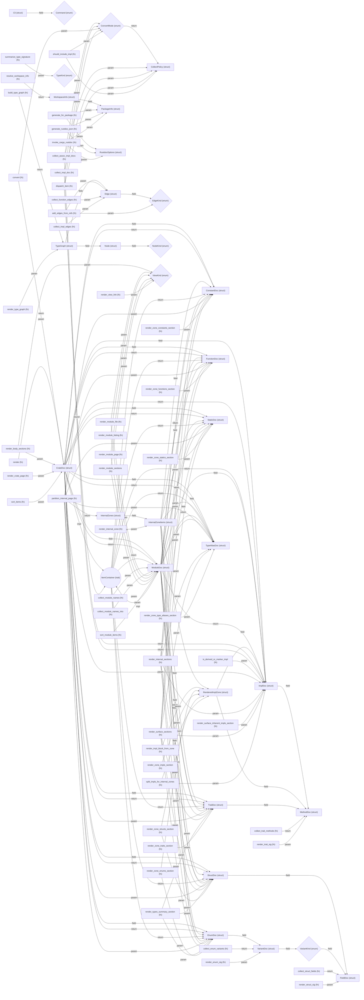

# Type Dependency Graph

```mermaid
graph LR
    n2["Cli (struct)"]
    n101["CollectPolicy (struct)"]
    n1{"Command (enum)"}
    n189["ConstantDoc (struct)"]
    n96{"ConvertMode (enum)"}
    n171["CrateDoc (struct)"]
    n367["Edge (struct)"]
    n333{"EdgeKind (enum)"}
    n181["EnumDoc (struct)"]
    n223["FieldDoc (struct)"]
    n185["FunctionDoc (struct)"]
    n177["ImplDoc (struct)"]
    n845["InternalZoneItems (struct)"]
    n863["InternalZones (struct)"]
    n192(("ItemContainer (trait)"))
    n239["MethodDoc (struct)"]
    n175["ModuleDoc (struct)"]
    n307["Node (struct)"]
    n277{"NodeKind (enum)"}
    n946["PackageInfo (struct)"]
    n823["RenderedImplZone (struct)"]
    n929["RustdocOptions (struct)"]
    n191["StaticDoc (struct)"]
    n179["StructDoc (struct)"]
    n183["TraitDoc (struct)"]
    n187["TypeAliasDoc (struct)"]
    n396["TypeGraph (struct)"]
    n897{"TypeKind (enum)"}
    n226["VariantDoc (struct)"]
    n511{"VariantKind (enum)"}
    n778{"ViewKind (enum)"}
    n964["WorkspaceInfo (struct)"]
    n415["add_edges_from_refs (fn)"]
    n414["build_type_graph (fn)"]
    n236["collect_assoc_impl_docs (fn)"]
    n224["collect_enum_variants (fn)"]
    n417["collect_function_edges (fn)"]
    n232["collect_impl_doc (fn)"]
    n418["collect_impl_edges (fn)"]
    n808["collect_module_names (fn)"]
    n810["collect_module_names_into (fn)"]
    n221["collect_struct_fields (fn)"]
    n237["collect_trait_methods (fn)"]
    n168["convert (fn)"]
    n213["dispatch_item (fn)"]
    n987["generate_for_package (fn)"]
    n979["generate_rustdoc_json (fn)"]
    n984["invoke_cargo_rustdoc (fn)"]
    n229["is_derived_or_marker_impl (fn)"]
    n878["partition_internal_page (fn)"]
    n807["render (fn)"]
    n818["render_body_sections (fn)"]
    n813["render_crate_page (fn)"]
    n249["render_enum_sig (fn)"]
    n886["render_impl_block_from_zone (fn)"]
    n880["render_internal_sections (fn)"]
    n881["render_internal_zone (fn)"]
    n811["render_module_file (fn)"]
    n817["render_module_listing (fn)"]
    n814["render_module_page (fn)"]
    n819["render_module_sections (fn)"]
    n248["render_struct_sig (fn)"]
    n892["render_surface_inherent_impls_section (fn)"]
    n820["render_surface_sections (fn)"]
    n250["render_trait_sig (fn)"]
    n419["render_type_graph (fn)"]
    n891["render_types_summary_section (fn)"]
    n815["render_view_link (fn)"]
    n889["render_zone_constants_section (fn)"]
    n883["render_zone_enums_section (fn)"]
    n887["render_zone_functions_section (fn)"]
    n885["render_zone_impls_section (fn)"]
    n890["render_zone_statics_section (fn)"]
    n882["render_zone_structs_section (fn)"]
    n884["render_zone_traits_section (fn)"]
    n888["render_zone_type_aliases_section (fn)"]
    n978["resolve_workspace_info (fn)"]
    n234["should_include_impl (fn)"]
    n172["sort_items (fn)"]
    n215["sort_module_items (fn)"]
    n877["split_impls_for_internal_zones (fn)"]
    n922["summarize_type_signature (fn)"]

    n2 -->|field| n1
    n96 -->|return| n101
    n171 -->|field| n189
    n171 -->|return| n189
    n171 -->|field| n181
    n171 -->|return| n181
    n171 -->|field| n185
    n171 -->|return| n185
    n171 -->|field| n177
    n171 -->|return| n177
    n171 -->|impl| n192
    n171 -->|field| n175
    n171 -->|return| n175
    n171 -->|field| n191
    n171 -->|return| n191
    n171 -->|field| n179
    n171 -->|return| n179
    n171 -->|field| n183
    n171 -->|return| n183
    n171 -->|field| n187
    n171 -->|return| n187
    n367 -->|field| n333
    n181 -->|field| n226
    n177 -->|field| n239
    n845 -->|field| n189
    n845 -->|field| n181
    n845 -->|field| n185
    n845 -->|field| n823
    n845 -->|field| n191
    n845 -->|field| n179
    n845 -->|field| n183
    n845 -->|field| n187
    n863 -->|field| n845
    n192 -->|return| n189
    n192 -->|return| n181
    n192 -->|return| n185
    n192 -->|return| n177
    n192 -->|return| n175
    n192 -->|return| n191
    n192 -->|return| n179
    n192 -->|return| n183
    n192 -->|return| n187
    n175 -->|field| n189
    n175 -->|return| n189
    n175 -->|field| n181
    n175 -->|return| n181
    n175 -->|field| n185
    n175 -->|return| n185
    n175 -->|field| n177
    n175 -->|return| n177
    n175 -->|impl| n192
    n175 -->|field| n191
    n175 -->|return| n191
    n175 -->|field| n179
    n175 -->|return| n179
    n175 -->|field| n183
    n175 -->|return| n183
    n175 -->|field| n187
    n175 -->|return| n187
    n307 -->|field| n277
    n823 -->|field| n177
    n823 -->|field| n239
    n179 -->|field| n223
    n183 -->|field| n239
    n396 -->|field| n367
    n396 -->|field| n307
    n226 -->|field| n511
    n511 -->|field| n223
    n964 -->|field| n946
    n415 -->|param| n367
    n415 -->|param| n333
    n414 -->|return| n396
    n236 -->|param| n101
    n236 -->|param| n96
    n236 -->|return| n177
    n224 -->|return| n226
    n417 -->|param| n367
    n232 -->|param| n101
    n232 -->|param| n96
    n232 -->|return| n177
    n418 -->|param| n367
    n808 -->|param| n175
    n810 -->|param| n175
    n221 -->|return| n223
    n237 -->|return| n239
    n168 -->|param| n96
    n168 -->|return| n171
    n213 -->|param| n101
    n213 -->|param| n96
    n213 -->|bound| n192
    n987 -->|param| n946
    n987 -->|param| n929
    n979 -->|param| n946
    n979 -->|param| n929
    n984 -->|param| n946
    n984 -->|param| n929
    n229 -->|param| n177
    n878 -->|param| n189
    n878 -->|param| n181
    n878 -->|param| n185
    n878 -->|param| n177
    n878 -->|return| n863
    n878 -->|param| n191
    n878 -->|param| n179
    n878 -->|param| n183
    n878 -->|param| n187
    n807 -->|param| n171
    n818 -->|param| n171
    n818 -->|param| n778
    n813 -->|param| n171
    n249 -->|param| n226
    n886 -->|param| n823
    n880 -->|param| n189
    n880 -->|param| n181
    n880 -->|param| n185
    n880 -->|param| n177
    n880 -->|param| n191
    n880 -->|param| n179
    n880 -->|param| n183
    n880 -->|param| n187
    n881 -->|param| n845
    n811 -->|param| n175
    n811 -->|param| n778
    n817 -->|param| n175
    n817 -->|param| n778
    n814 -->|param| n175
    n814 -->|param| n778
    n819 -->|param| n175
    n819 -->|param| n778
    n248 -->|param| n223
    n892 -->|param| n177
    n820 -->|param| n189
    n820 -->|param| n181
    n820 -->|param| n185
    n820 -->|param| n177
    n820 -->|param| n191
    n820 -->|param| n179
    n820 -->|param| n183
    n820 -->|param| n187
    n250 -->|param| n239
    n419 -->|param| n396
    n891 -->|param| n181
    n891 -->|param| n179
    n891 -->|param| n183
    n815 -->|param| n778
    n889 -->|param| n189
    n883 -->|param| n181
    n883 -->|param| n823
    n887 -->|param| n185
    n885 -->|param| n823
    n890 -->|param| n191
    n882 -->|param| n823
    n882 -->|param| n179
    n884 -->|param| n183
    n888 -->|param| n187
    n978 -->|return| n964
    n234 -->|param| n101
    n234 -->|param| n96
    n172 -->|param| n171
    n215 -->|param| n175
    n877 -->|param| n177
    n877 -->|return| n823
    n922 -->|param| n897
```
