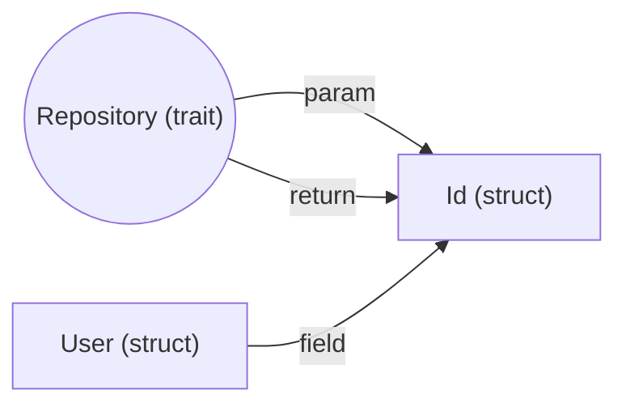

# Type Dependency Graph

```mermaid
graph LR
    n1["Id (struct)"]
    n127(("Repository (trait)"))
    n74["User (struct)"]

    n127 -->|param| n1
    n127 -->|return| n1
    n74 -->|field| n1
```
