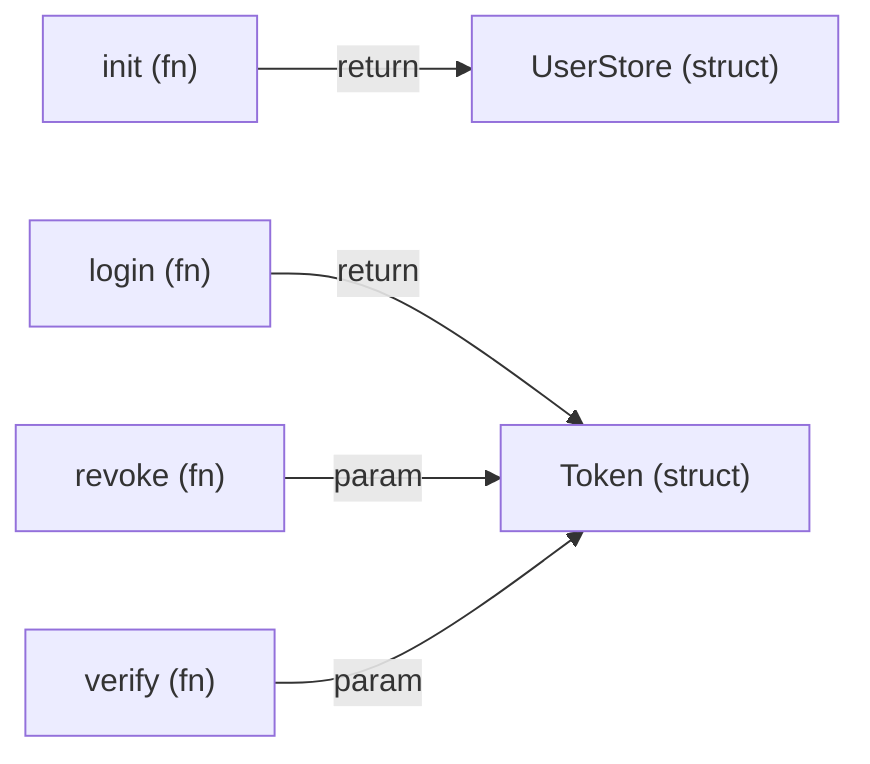

# Type Dependency Graph

```mermaid
graph LR
    n3["Token (struct)"]
    n53["UserStore (struct)"]
    n93["init (fn)"]
    n43["login (fn)"]
    n45["revoke (fn)"]
    n44["verify (fn)"]

    n93 -->|return| n53
    n43 -->|return| n3
    n45 -->|param| n3
    n44 -->|param| n3
```
